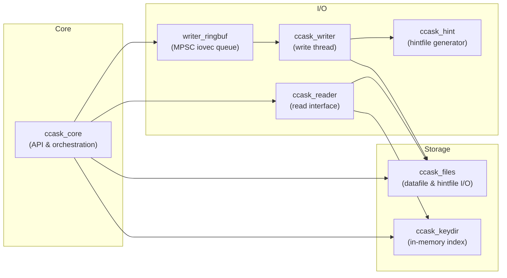
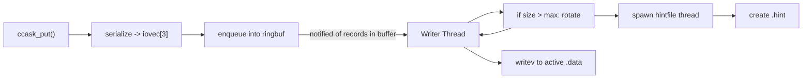
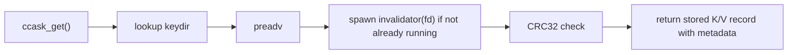

# ccask
> **What is ccask?** An ultra‑fast, append‑only, crash‑safe KV‑engine in C, inspired by Riak's Bitcask and designed to be embedded in high‑performance systems.

[](https://www.gnu.org/licenses/lgpl-3.0)

## Table-Of-Contents
1. [Introduction](#introduction)
2. [Features](#features)
3. [Installation](#installation)
    - [Prerequisites](#prerequisites)
    - [Method 1: Git Submodule/Clone + CMake](#method-1-git-submoduleclone--cmake)
    - [Method 2: System Install + find_package](#method-2-system-install--find_package)
    - [Method 3: Manual Build & Link](#method-3-manual-build--link)
4. [Getting Started](#getting-started)
5. [Architecture](#architecture)
    - [Initialization & Shutdown Flow](#initialization--shutdown-flow)
    - [Write Path Flow](#write-path-flow)
    - [Read Path Flow](#read-path-flow)
6. [License](#license)

## Introduction

**ccask** is a pure‑C re‑implementation of the Bitcask log‑structured key/value store. It provides a fast, append‑only on‑disk storage engine with an in‑memory hash index (the "keydir"), hint files for fast recovery, and support for threading and CRC‑protected records.

> Inspired by [Bitcask: A Log‑Structured Hash Table for Fast Key/Value Data](https://riak.com/assets/bitcask-intro.pdf)

## Features
- 🗒️ **Append‑Only Storage**  
  Sequential write pattern for maximum throughput on modern SSDs and HDDs.

- ⚡ **High-Performance Write Path**  
  All writes are append-only and non-blocking, using memory-mapped ring buffers.

- 🧠 **In‑Memory Key Directory**  
  Fast O(1) lookups via a `uthash`‑based hash table that maps each key to its on‑disk location.

- 💾 **Hint Files for Fast Recovery**  
  Per‑segment hint files dramatically reduce startup times by avoiding full log scans.

- 🔒 **Data Integrity with CRC32**  
  Every record includes a CRC32 checksum, verified on read to detect on‑disk corruption.

- 🔐 **Thread‑Safe I/O**  
  Fine‑grained POSIX locks plus a file‑descriptor invalidator ensure safe concurrent access.

- 🔧 **Minimal C Library API**  
  Simple, well‑typed functions for `init`, `shutdown`, `put`, `get`, `delete`, and key iteration—easy to embed in any C project.

## Installation

### Prerequisites
- **C11 compiler** (GCC 7+, Clang 6+, or equivalent)
- **C++17 compiler** (for internal logging components)
- **CMake 3.15+**
- **Dependencies:**
  - `zlib` (required)
  - `spdlog` (optional, for logging - can be disabled)
  - `pthreads` (usually available on POSIX systems)

### Method 1: Git Submodule/Clone + CMake
Best for embedding ccask directly in your project.

**Option A: As a Git Submodule**
```bash
# In your project root
git submodule add https://github.com/ShardulNalegave/ccask.git third_party/ccask
git submodule update --init --recursive
```

**Option B: Clone directly**
```bash
# In your project's third_party directory
git clone https://github.com/ShardulNalegave/ccask.git
```

Then in your `CMakeLists.txt`:
```cmake
# Add ccask subdirectory
add_subdirectory(third_party/ccask)

# Link to your target
target_link_libraries(your_app PRIVATE ccask)
```

Build your project:
```bash
mkdir build && cd build
cmake .. -DCCASK_ENABLE_LOGGING=ON
cmake --build .
```

### Method 2: System Install + find_package
Best for system-wide installation and multiple projects using ccask.

**Step 1: Install ccask**
```bash
git clone https://github.com/ShardulNalegave/ccask.git
cd ccask
mkdir build && cd build

# Configure
cmake .. \
  -DCMAKE_BUILD_TYPE=Release \
  -DCMAKE_INSTALL_PREFIX=/usr/local \
  -DCCASK_ENABLE_LOGGING=ON \
  -DCCASK_BUILD_SHARED=OFF

# Build and install
make -j$(nproc)
sudo make install
```

**Step 2: Use in your project**
```cmake
# In your CMakeLists.txt
find_package(ccask REQUIRED)
target_link_libraries(your_app PRIVATE ccask::ccask)
```

**Step 3: Build your project**
```bash
mkdir build && cd build
cmake ..
cmake --build .
```

### Method 3: Manual Build & Link
For complete control over the build process.

**Step 1: Build ccask**
```bash
git clone https://github.com/ShardulNalegave/ccask.git
cd ccask
mkdir build && cd build

cmake .. \
  -DCMAKE_BUILD_TYPE=Release \
  -DCCASK_ENABLE_LOGGING=ON

make -j$(nproc)
```

This produces `libccask.a` in the `build/` directory.

**Step 2: Compile your application**
```bash
gcc -std=c11 \
    -I/path/to/ccask/include \
    -L/path/to/ccask/build \
    your_app.c \
    -lccask -lz -lpthread -lspdlog -lstdc++ \
    -o your_app
```

**Note:** If you built with `-DCCASK_ENABLE_LOGGING=OFF`, omit `-lstdc++` and `-lspdlog`.

## Getting Started
**ccask** can be used as an embedded key-value database in any other application. The public API is accessible through the `ccask.h` header file.

```c

#include "ccask.h"

int main() {
    ccask_options_t opts;
    opts.data_dir = "<path-to-data-directory>";
    opts.writer_ringbuf_capacity = 100;
    opts.datafile_rotate_threshold = 100;
    ccask_init(opts);

    /* You can run get, put, delete, etc operations here */

    ccask_shutdown();
    return 0;
}

```

### Configuration Options
`ccask` provides the following configuration options when calling `ccask_init`:-
1. `data_dir`: Directory where all datafiles are stored
2. `writer_ringbuf_capacity`: Capacity of the Writer Ring-Buffer
3. `datafile_rotate_threshold`: Size after which datafiles must be rotated (Note: This doesn't have any effect on existing datafiles)

## Architecture
`ccask` is organized into discrete modules, each responsible for a clear portion of functionality:

1. **core**  
   Exposes the public C API (`init`, `shutdown`, `put`, `get`, `delete`, `iterator`) and orchestrates startup, shutdown, and thread lifecycles.

2. **files**  
   Manages on‑disk datafiles and hintfiles: scanning the directory, opening/closing FDs, file rotation, and low‑level I/O primitives.

3. **keydir**  
   Maintains the in‑memory hash table. Handles recovery from hintfiles and datafiles during bootup.

4. **reader**  
   Implements synchronous read operations (`get`, iteration) by consulting the keydir, issuing `preadv` calls, and spawning per‑file FD invalidator threads to close idle descriptors.

5. **writer**  
   Runs in its own thread: pulls pre‑serialized records from the **writer_ringbuf**, appends them via `writev` to the active datafile, triggers rotation when the size threshold is reached, and invokes **hintfile generation** for closed segments.

6. **writer_ringbuf**  
   A fixed‑capacity, lock‑protected MPSC queue of `struct iovec[3]` records, decoupling client `put()` calls from disk writes for high throughput.

7. **hint**  
   When the writer rotates a datafile, this module spawns a dedicated thread to scan the closed file and emit a compact `<id>.hint` file, used for fast keydir rebuilding on restart.




### Initialization & Shutdown Flow

On `ccask_init(options)`:
1. files scans provided data-path, builds the file linked-list + hash-table, detects .data and .hint pairs, opens or creates the active segment.
2. keydir reads every `<id>.hint` to populate its hash table, then scans the active .data file for any missing entries.
3. writer thread is spawned, waiting on the ring buffer.

On `ccask_shutdown()`:
1. Signal writer to flush and join.
2. Close all open FDs in files.
3. Free the keydir hash table.
4. Destroy the ring buffer and any remaining threads.

### Write Path Flow
`ccask` provides both non-blocking (`put`, `delete`) blocking (`put_blocking`, `delete_blocking`) variants for write operations.

While the blocking calls are quite straightforward, the non-blocking variants use a `writer_ringbuf` to enqueue records which are then written by a dedicated `writer` thread. This allows for higher throughput.

1. Caller invokes `ccask_put(key, key_size, value, value_size)`.
2. `core` serializes a datafile record into a struct iovec[3].
3. Enqueues the iovec array into the `writer_ringbuf`.
4. `writer` thread wakes, pops the record, and writev‑appends to the active .data file.
5. If the file size exceeds the threshold, files rotates the segment:
    - Close old segment, rename it to `<id>.data`.
    - Create a fresh active `<id+1>.active`.
    - Signal `writer` to continue on the new file.
6. `writer` invokes the **Hintfile generator** to spawn a thread that creates `<id>.hint` for the closed segment.



### Read Path Flow
1. Caller invokes `ccask_get(key, key_size, &out_record)`.
2. `reader` module looks up the latest key-directory record for provided key.
3. Issues a `preadv` on the correct datafile via `files` to read header, key, and value in one system call.
4. Spawns an **FD invalidator** thread for that file (if not already running) to close the descriptor after idle timeout.
5. **Verifies CRC32**, returns the value and metadata to the caller.

**Note:-** Read calls (get) are blocking calls, they will block the caller thread till the value is read.



---

## License
This project is licensed under the **GNU Lesser General Public License v3.0 (LGPL-3.0)**.
You may use, distribute, and modify `ccask` under the terms of the LGPL as published by the Free Software Foundation.

For more information, see the [COPYING.LESSER](COPYING.LESSER) and [COPYING](COPYING) files.
